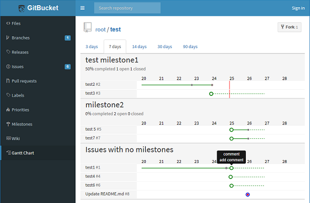

# gitbucket-gantt-plugin

A [GitBucket](https://github.com/gitbucket/gitbucket) plugin rendering Gantt Chart.  
The lines and points are based on Milestones, Iusses, Pull requests, Comments, and Commit linked to the Issue.   

## Installation

Download jar file from [the release page](https://github.com/kasancode/gitbucket-gantt-plugin/releases) and put into `GITBUCKET_HOME/plugins`.

## Version

Plugin version|GitBucket version
:---|:---
1.1.x|4.32.x -
1.0.x|4.26.x - 4.31.x

## Build from source

`$ sbt assembly`